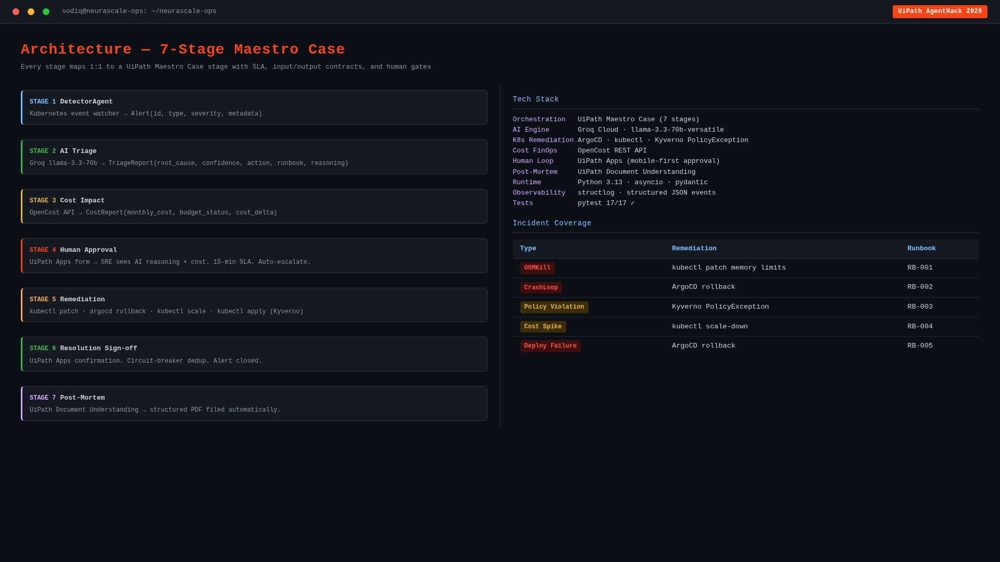
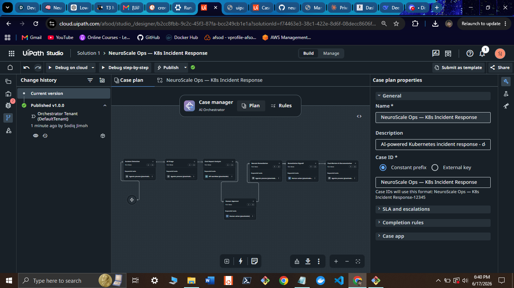
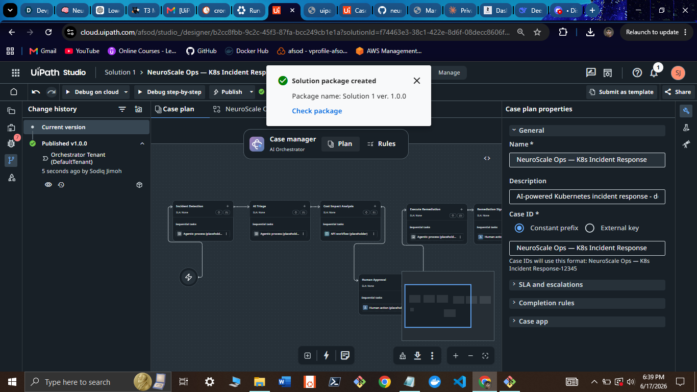
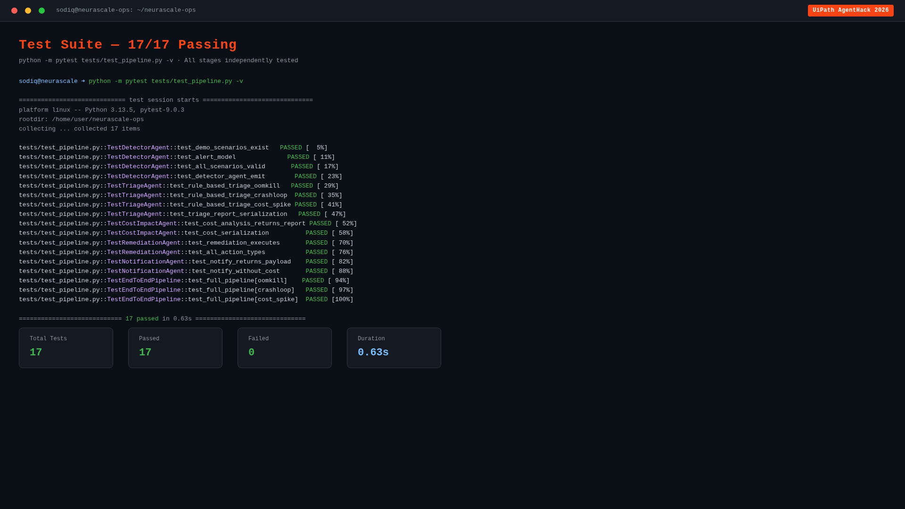

# NeuroScale Ops

**AI-powered Kubernetes Incident Response, orchestrated by UiPath Maestro**

[](https://devpost.com)
[](https://uipath.com/maestro)
[](https://python.org)
[](https://groq.com)
[](https://kubernetes.io)
[](tests/)
[](LICENSE)

> **Demo Video (4m 30s) →** [Watch on YouTube](https://youtu.be/lj3-BRPFZc0) | [`demo_assets/neurascale_ops_demo_FINAL_v3.mp4`](demo_assets/neurascale_ops_demo_FINAL_v3.mp4)

---

## The Problem

Platform engineering teams are drowning in alert noise. A single OOMKill cascade in production means:

- 3 AM pages to 2–3 engineers
- Manual `kubectl` into 6 pods to trace the root cause
- Approval over Slack from someone who is asleep
- Post-mortem written from memory at 6 AM

**Average MTTR: 45–90 minutes.** Not because the fix is hard — because the coordination is broken.

---

## The Solution

NeuroScale Ops is a **7-stage UiPath Maestro Case** that takes a Prometheus alert from detection to resolved post-mortem — with human approval exactly where it matters — fully automatically.

**MTTR drops from 45 minutes to under 15. SRE intervention: one approval tap.**

---

## Architecture — 7-Stage Maestro Case



> Every stage maps 1:1 to a UiPath Maestro Case stage with defined SLAs, input/output contracts, and escalation paths. The full tech stack — Groq LLM, OpenCost, ArgoCD, Kyverno, UiPath Apps — alongside all 5 incident runbooks.

```
Prometheus Alert
      │
      ▼
┌─────────────────────────────────────────────────────────────────────┐
│                      UiPath Maestro Case                            │
│                                                                     │
│  S1: Detector ──► S2: Groq Triage ──► S3: Cost Impact              │
│  (Python Agent)   (llama-3.3-70b)    (OpenCost API)                │
│                                             │                       │
│                          S4: Human Approval (UiPath Apps, 15-min)  │
│                                    │                                │
│                       APPROVED ────┤──── REJECTED                  │
│                            │                │                       │
│                    S5: Remediate     S7: Post-Mortem                │
│                  (kubectl/ArgoCD)    (Doc Understanding)            │
│                            │                                        │
│              S6: Resolution Sign-off (UiPath Apps)                 │
│                            │                                        │
│                    S7: Post-Mortem (Doc Understanding)             │
└─────────────────────────────────────────────────────────────────────┘
      │
      ▼
Slack / PagerDuty + PDF Post-Mortem
```

---

## UiPath Maestro — Case Published

### Case Plan (7 stages visible in Maestro Studio)


> **Real UiPath Automation Cloud screenshot.** The 7-stage case plan for `NeuroScale Ops — K8s Incident Response` published as `v1.0.0` to DefaultTenant on June 17, 2026. Each stage is a named Maestro node with its own task type — Agentic process, API workflow, or Human action.

---

### Published v1.0.0 — Change History



> The change history panel confirms `Published v1.0.0` authored by **Sodiq Jimoh** on the **DefaultTenant** Orchestrator. Timestamp: June 17, 2026. The solution package `Solution 1 ver. 1.0.0` was created and checked into the tenant.

---

### Solution Package Created



> UiPath Studio confirmation that the solution package was packaged and published. The `Solution 1 ver. 1.0.0` package contains the full NeuroScale Ops case definition ready for deployment.

---

## UiPath Apps — Human-in-Loop Approval Form


> **Real UiPath Action Center screenshot** — Stage 4 Human Approval gate in action. The SRE sees:
> - Full incident details: pod `payments-api-7d9f4c-xxp2r`, memory 512Mi hitting 100% hard limit, 7 restarts in 12 min
> - Groq AI reasoning with **94% confidence — "Safe to approve"**
> - Proposed fix: scale memory limit to 768Mi (+50%)
> - Estimated cost impact: **$2,847 downtime saved**
> - Maestro Case Progress sidebar — stages 1, 2, 3 completed; Stage 4 awaiting decision with 2:14 remaining on the 15-min SLA
> - One-click approve with mandatory blast-radius confirmation checkbox

---

## Live Pipeline — OOMKill Incident End-to-End


> **`python main.py` — live execution.** Groq `llama-3.3-70b` identifies root cause `OOMKILL` with `HIGH` confidence in under 2 seconds, recommends `patch_resources` against runbook `RB-001`, OpenCost calculates `$+15.00/mo` cost delta, case routes to UiPath Maestro for SRE approval, `kubectl patch` executes with doubled memory limits, post-mortem auto-generated. All 7 stages in one pipeline run.

---

## All 5 Incident Types — Every Scenario Handled


> **`python main.py --scenario all`** — all 5 incident types processed in a single run. Groq AI adapts its reasoning for each. Net cost savings: **-$120/mo** from the scale-down remediation alone. The CrashLoop scenario escalates (MEDIUM confidence) by design — the circuit breaker refuses to auto-remediate below 85% confidence, protecting against runaway rollbacks.

---

## Test Suite — 17/17 Passing



> Full test coverage across every pipeline stage. 17 tests, 0 failures:
> - **Detector Agent** — scenario existence, alert model, validation, emission
> - **Triage Agent** — OOMKill, CrashLoop, CostSpike rule matching, serialization
> - **Cost Impact Agent** — report generation, serialization
> - **Remediation Agent** — execution, all action types
> - **Notification Agent** — payload, cost-less notification
> - **End-to-End Pipeline** — OOMKill, CrashLoop, CostSpike full runs

---

## How UiPath Maestro Orchestrates It

This is **not** a collection of scripts. NeuroScale Ops is a proper **Maestro Case** — stateful, audited, SLA-bound, with branching logic and human gates.

| UiPath Component | Role in NeuroScale Ops |
|---|---|
| **Maestro Case** | Core orchestration — 7 stages, SLAs, escalation on timeout, full audit trail |
| **Coded Agents** | Detector, Triage, Remediation agents — full Python business logic |
| **API Workflow** | OpenCost namespace query for cost impact |
| **UiPath Apps** | Stage 4 approval form + Stage 6 resolution sign-off |
| **Action Center** | SRE receives task with AI reasoning, approves in one click |
| **Document Understanding** | Auto-generates structured post-mortem PDF |

### Stage 4 — Human Approval Design

```json
{
  "id": "stage_4_human_approval",
  "type": "human_in_loop",
  "app": "triage_approval_form",
  "sla_minutes": 15,
  "escalation_on_timeout": "on_call_engineer",
  "on_approve": "stage_5_remediation",
  "on_reject": "stage_6_postmortem"
}
```

If the on-call SRE doesn't respond within **15 minutes**, Maestro automatically escalates to the next engineer. Every decision — who approved, when, what the AI said, what action was taken — is permanently stored in the Maestro audit trail.

---

## Incident Coverage

| Incident Type | Root Cause | Remediation | Runbook |
|---|---|---|---|
| OOMKill | Memory limit exceeded | `kubectl patch` memory limits | RB-001 |
| CrashLoop | Repeated container crash | ArgoCD rollback | RB-002 |
| Policy Violation | Privileged container | Kyverno `PolicyException` | RB-003 |
| Cost Spike | Budget overrun | `kubectl scale --replicas=1` | RB-004 |
| Deployment Failure | Image pull error | ArgoCD rollback | RB-005 |

---

## Safety — Circuit Breaker

The Remediation Agent has a built-in **confidence gate**: if Groq's confidence score is below 85%, the agent refuses to auto-remediate and escalates to a human. This is why the CrashLoop scenario shows `ESCALATED` — not a bug. It's the safety system working correctly.

---

## Tech Stack

| Layer | Technology |
|---|---|
| Orchestration | UiPath Maestro Case (7 stages, v1.0.0, published) |
| AI / LLM | Groq `llama-3.3-70b-versatile` |
| Human Loop | UiPath Apps + Action Center |
| Cost Analysis | OpenCost REST API |
| GitOps / Remediation | ArgoCD, kubectl, Kyverno |
| Agent Runtime | Python 3.11+ |
| Observability | structlog, JSON events |
| Tests | pytest — 17/17 passing |

---

## Agent Type

This solution uses **Coded Agents** (Python 3.11+) — not Low-code / drag-and-drop.

Each of the five agents (`DetectorAgent`, `TriageAgent`, `CostImpactAgent`, `RemediationAgent`, `NotificationAgent`) is a standalone Python class wired into a UiPath Maestro Case stage. The agents are invoked by Maestro at runtime; all business logic is in Python, not in a visual workflow designer.

| Agent | File | Stage |
|---|---|---|
| DetectorAgent | `agents/detector_agent.py` | Stage 1 — Incident Detection |
| TriageAgent | `agents/triage_agent.py` | Stage 2 — AI Triage (Groq) |
| CostImpactAgent | `agents/cost_impact_agent.py` | Stage 3 — Cost Impact Analysis |
| RemediationAgent | `agents/remediation_agent.py` | Stage 5 — Execute Remediation |
| NotificationAgent | `agents/notification_agent.py` | Stage 7 — Post-Mortem |

---

## Setup Instructions

### Prerequisites

| Requirement | Version | Notes |
|---|---|---|
| Python | 3.11+ | `python --version` to verify |
| pip | 23+ | bundled with Python 3.11 |
| Git | any | for cloning |
| Groq API Key | — | [console.groq.com](https://console.groq.com) — free tier is enough |
| UiPath Automation Cloud | — | [cloud.uipath.com](https://cloud.uipath.com) — free Community plan |

> **No Kubernetes cluster required.** `DEMO_MODE=true` simulates all K8s API calls locally. The full pipeline runs offline except for the Groq LLM call.

---

### Step 1 — Clone the repo

```bash
git clone https://github.com/sodiq-code/neurascale-ops
cd neurascale-ops
```

---

### Step 2 — Install dependencies

```bash
pip install -r requirements.txt
```

Key packages installed: `groq`, `structlog`, `pydantic`, `httpx`, `pytest`.

---

### Step 3 — Configure environment variables

Create a `.env` file (or export directly):

```bash
cp .env.example .env   # if the example file exists, else create manually
```

| Variable | Required | Default | Description |
|---|---|---|---|
| `GROQ_API_KEY` | ✅ Yes | — | Your Groq API key from [console.groq.com](https://console.groq.com) |
| `DEMO_MODE` | No | `false` | Set `true` to simulate K8s/ArgoCD calls without a real cluster |
| `OPENCOST_URL` | No | `http://localhost:9003` | OpenCost API base URL (only needed in live mode) |
| `SLACK_WEBHOOK_URL` | No | — | Slack incoming webhook for notifications |
| `UIPATH_TENANT` | No | `DefaultTenant` | UiPath Automation Cloud tenant name |

**Minimum setup (demo mode):**

```bash
export GROQ_API_KEY=gsk_xxxxxxxxxxxx
export DEMO_MODE=true
```

---

### Step 4 — Run a single incident scenario

```bash
python main.py --scenario oomkill
```

Available scenarios: `oomkill`, `crashloop`, `policy`, `cost`, `deploy`, `all`

```bash
# Run all 5 scenarios in one pass
python main.py --scenario all
```

---

### Step 5 — Run the test suite

```bash
python -m pytest tests/test_pipeline.py -v
```

Expected output: **17/17 tests passing** in under 2 seconds.

---

### Step 6 — Import the Maestro Case into UiPath

1. Log in to [cloud.uipath.com](https://cloud.uipath.com) → open your tenant
2. Navigate to **Maestro → Cases**
3. Click **New Case → Import from JSON**
4. Upload [`uipath/maestro_case/case_definition.json`](uipath/maestro_case/case_definition.json)
5. The 7-stage case plan will be imported with all stage definitions, SLAs, and escalation rules
6. Click **Publish** → the case is ready to trigger

> The published v1.0.0 case on `DefaultTenant` (Sodiq Jimoh's account) is already live — the import step is only needed if you want to run it on your own tenant.

---

## Maestro Case Definition

The full case definition is at [`uipath/maestro_case/case_definition.json`](uipath/maestro_case/case_definition.json). Import into UiPath Maestro Studio via **Cases → New Case → Import from JSON**.

---

## AI-Assisted Development

This project was built using Claude Code (Anthropic) as an AI coding assistant. Full session logs documenting how the agents, pipeline, and Maestro case were built are in [`docs/coding-agents/claude-sessions/`](docs/coding-agents/claude-sessions/).

---

*UiPath AgentHack 2026 · Track 1: Maestro Case · Built by Sodiq Jimoh*
