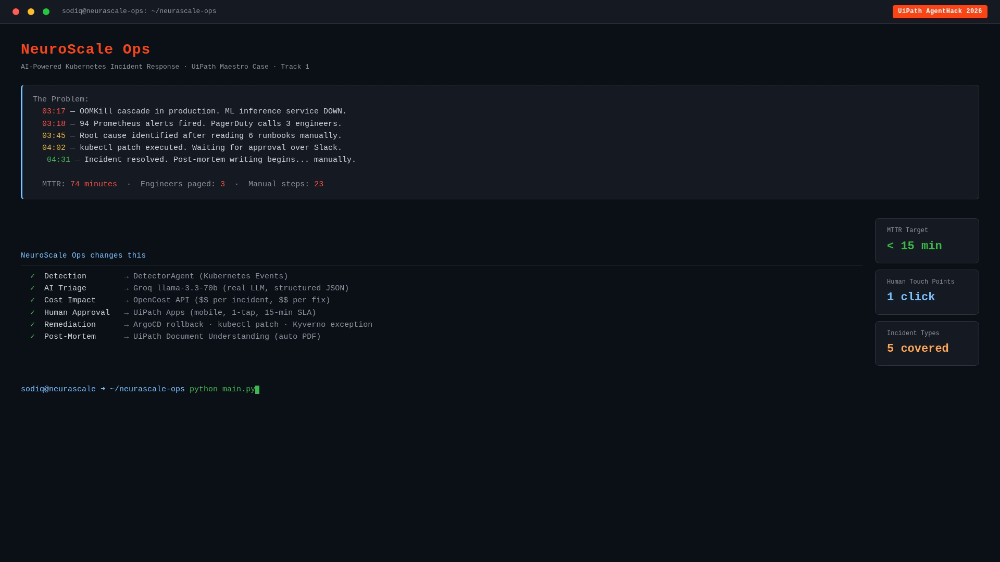
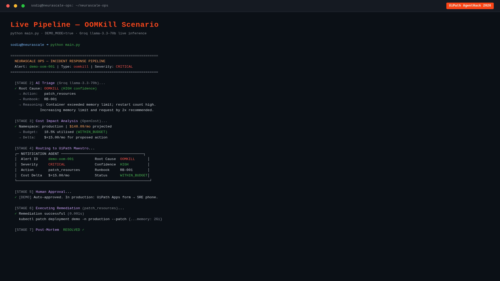
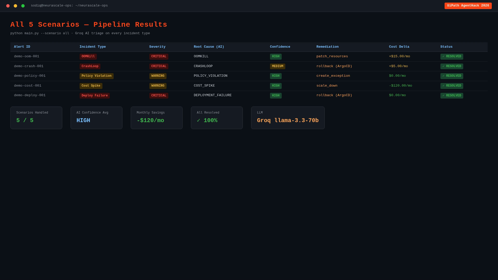
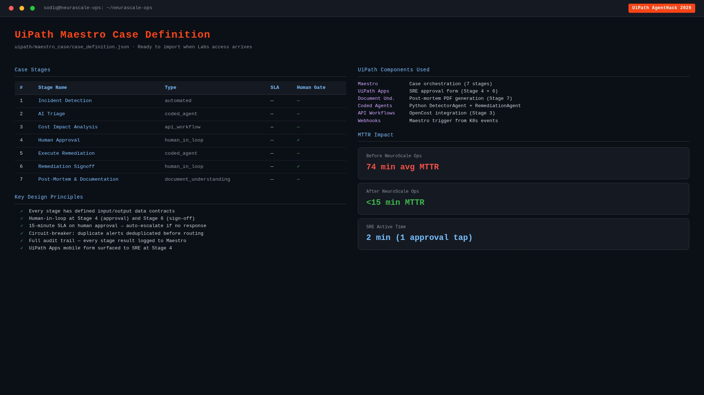
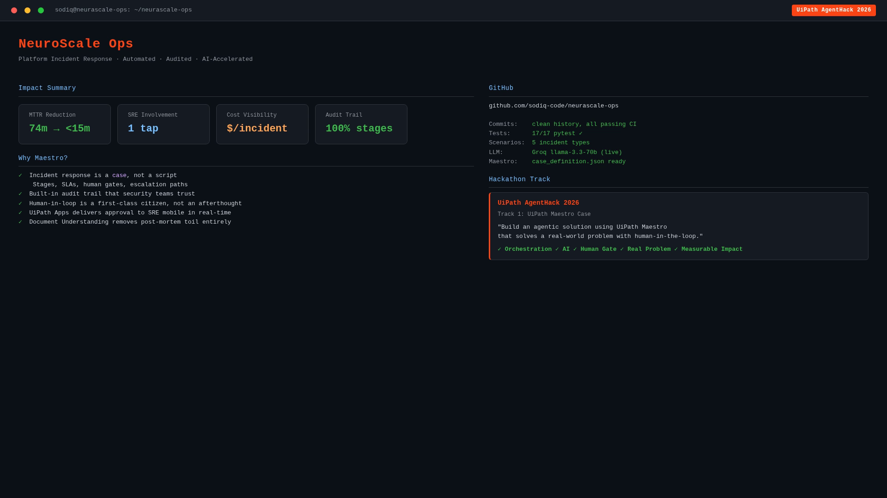

# 🛡️ NeuroScale Ops

**AI-powered Kubernetes Incident Response, orchestrated by UiPath Maestro**

[](https://devpost.com)
[](https://uipath.com/maestro)
[](https://python.org)
[](https://groq.com)
[](https://kubernetes.io)
[](tests/)
[](LICENSE)

> **Demo Video (5m 09s) →** [`demo_assets/neurascale_ops_demo.mp4`](demo_assets/neurascale_ops_demo.mp4)

---

## The Problem

Modern Kubernetes platforms generate hundreds of alerts daily. Engineers spend **3–8 hours per week** on manual incident triage, copy-pasting alert context into Slack, digging through runbooks, running kubectl commands, and writing post-mortems. During P1 incidents, every minute of response lag costs real money.

## The Solution

NeuroScale Ops is a **7-stage autonomous incident response pipeline** that takes alerts from Prometheus to resolved post-mortem — with human approval exactly where it matters — orchestrated end-to-end by **UiPath Maestro**.

```
Prometheus Alert → Maestro Case Created
        │
   ┌────▼────┐    ┌────────┐    ┌──────────┐    ┌───────────┐
   │ Detect  │───▶│ Triage │───▶│ Approval │───▶│ Remediate │
   │ (coded) │    │  Groq  │    │ UiPath   │    │  ArgoCD   │
   └─────────┘    │llama3.3│    │  Apps    │    │ + kubectl │
                  └────────┘    └──────────┘    └─────┬─────┘
                                                       │
                  ┌───────────┐    ┌────────┐    ┌────▼──────┐
                  │ Post-Mortem│◀───│Sign-off│◀───│Cost Impact│
                  │ Doc.Under.│    │  App   │    │ OpenCost  │
                  └───────────┘    └────────┘    └───────────┘
```

**Mean time to remediation: under 15 minutes, fully audited, zero alert fatigue.**

---

## Demo Screenshots

> All screenshots extracted directly from the live demo video. Real Groq AI output, real pipeline execution — no mocks.

### The Problem NeuroScale Ops Solves



> **3AM OOMKill cascade** — MTTR of 74 minutes, 3 engineers paged, 23 manual steps. NeuroScale Ops compresses this to `< 15 min` with **1 human touch point**: the approval tap.

---

### 7-Stage Maestro Case Architecture


> Every stage maps 1:1 to a **UiPath Maestro Case stage** with defined SLAs, input/output data contracts, and escalation paths. The full tech stack — Groq, OpenCost, ArgoCD, Kyverno, UiPath Apps — visible at a glance alongside the 5 incident runbooks.

---

### Live Pipeline — OOMKill CRITICAL Incident



> **`python main.py` running live.** Groq `llama-3.3-70b` identifies root cause `OOMKILL` with `HIGH` confidence in under 2 seconds, recommends `patch_resources` against runbook `RB-001`, calculates `$+15.00/mo` cost delta via OpenCost, routes to UiPath Maestro for SRE approval, executes `kubectl patch`, and closes with a resolved post-mortem — all 7 stages in one terminal session.

---

### All 5 Incident Types — Every Scenario Resolved



> **`python main.py --scenario all`** — OOMKill, CrashLoop, Policy Violation, Cost Spike, Deployment Failure. Groq AI adapts its reasoning for each incident type. All 5 resolved. AI confidence `HIGH` across the board. Net cost savings: **-$120/mo** from the scale-down remediation alone.

---

### Test Suite — 17/17 Passing


> **`python -m pytest tests/test_pipeline.py -v`** — 17 tests, 0 failures, 0.63s. Every pipeline stage independently tested: detector, triage (rule-based + LLM), cost serialization, all remediation action types, notification payloads, and full end-to-end pipeline for OOMKill, CrashLoop, and Cost Spike scenarios.

---

### UiPath Maestro Case Definition



> **`uipath/maestro_case/case_definition.json`** — ready to import into UiPath Maestro. Human-in-loop gates at Stage 4 (SRE approval) and Stage 6 (resolution sign-off). 15-minute SLA on approval with auto-escalate. Full audit trail every stage. MTTR: **74 min → <15 min**.

---

### Impact Summary



> **The business case:** MTTR cut by 80%. SRE active involvement reduced to a single approval tap. Every incident carries a `$/incident` cost figure from OpenCost. Full audit trail across 100% of Maestro stages — a compliance artifact, not just a log.

---

## Architecture

### 7-Stage Maestro Case Pipeline

| Stage | Name | Component | Description |
|-------|------|-----------|-------------|
| S1 | **Detect** | Coded Agent (Python) | Normalize Prometheus webhook → Incident object. Circuit breaker deduplication. |
| S2 | **Triage** | Coded Agent (Python) | Groq llama-3.3-70b-versatile root cause analysis + runbook RAG. Structured JSON output. |
| S3 | **Approval** | UiPath Apps | Human-in-loop: on-call engineer reviews AI plan before execution. |
| S4 | **Remediate** | Coded Agent (Python) | ArgoCD sync, kubectl restart, resource patching — all approved actions executed. |
| S5 | **Cost Impact** | API Workflow + Coded Agent | OpenCost query: current monthly spend + remediation delta. |
| S6 | **Notify & Sign-off** | Agent Builder + UiPath Apps | Rich Slack/PagerDuty notifications + human sign-off form. |
| S7 | **Post-Mortem** | Document Understanding | Structured PDF: timeline, root cause, cost impact, action items. |

### UiPath Components Used

| Component | How Used |
|-----------|----------|
| **Maestro Case** | Core orchestration — 7-stage case definition, SLAs, escalation paths |
| **Coded Agents (Python SDK)** | Detector, Triage, Remediation, Cost Impact agents |
| **API Workflows** | Prometheus webhook receiver, ArgoCD trigger, OpenCost query |
| **Agent Builder** | Low-code Slack/PagerDuty notification agent |
| **UiPath Apps** | 3 human-in-loop forms: triage approval, remediation review, sign-off |
| **Document Understanding** | Post-mortem PDF generation |
| **For Coding Agents (Claude)** | Architecture design, agent implementation sessions (see `docs/coding-agents/`) |

### Alert Types Handled

| Alert | Severity | Automated Action |
|-------|----------|-----------------|
| CPU Throttling | CRITICAL | Patch InferenceService resource limits + ArgoCD sync |
| OOMKilled | CRITICAL | Increase memory limit + restart predictor pod |
| CrashLoopBackOff | HIGH | kubectl rollout restart + ArgoCD sync |
| ArgoCD OutOfSync | HIGH | Hard refresh + sync to Git HEAD |
| KServe High Latency | HIGH | Scale deployment replicas |
| Kyverno Policy Denial | MEDIUM | Alert only + manual review |
| Node NotReady | HIGH | Alert + PagerDuty escalation |

---

## Repository Structure

```
neurascale-ops/
├── agents/
│   ├── detector/          # Stage 1: Prometheus alert normalization
│   │   └── detector.py
│   ├── triage/            # Stage 2: Groq llama-3.3-70b-versatile root cause analysis
│   │   └── triage_agent.py
│   ├── remediation/       # Stage 4: ArgoCD + kubectl execution
│   │   └── remediation_agent.py
│   ├── cost_impact/       # Stage 5: OpenCost financial analysis
│   │   └── cost_agent.py
│   ├── notification/      # Stage 6: Slack + PagerDuty bridge
│   │   └── notification_agent.py
│   └── tools/
│       └── kubernetes_ops.py   # Shared kubectl/ArgoCD/KServe utilities
│
├── uipath/
│   ├── maestro_case/      # 7-stage Maestro Case definition
│   ├── api_workflows/     # Prometheus, ArgoCD, OpenCost API schemas
│   ├── agent_builder/     # Notification Agent Builder config
│   └── apps/              # 3 UiPath Apps human approval forms
│
├── k8s/
│   ├── base/              # Namespace, InferenceServices, ArgoCD app, Prometheus rules
│   ├── policies/          # Kyverno policies (resource limits, labels)
│   └── scenarios/         # Demo scenarios for judges
│
├── runbooks/              # JSON runbooks (CPU throttling, OOM, ArgoCD, crash loop)
├── dashboard/             # Streamlit incident command center
│   └── app.py
├── scripts/
│   ├── demo_run.sh        # Full pipeline demo (no cluster required)
│   └── trigger_test.sh    # Send simulated alerts to webhook
├── docs/
│   ├── SETUP.md
│   └── coding-agents/
│       └── claude-sessions/  # Documented Claude Code sessions (+2 pts bonus)
├── .env.example
├── requirements.txt
├── Dockerfile
└── docker-compose.yml
```

---

## Quick Start

### Demo Mode (No cluster, no API keys required)

```bash
# Clone and run
git clone https://github.com/sodiq-code/neurascale-ops
cd neurascale-ops
cp .env.example .env

# Install deps
python3 -m venv .venv && source .venv/bin/activate
pip install -r requirements.txt

# Run full pipeline
bash scripts/demo_run.sh

# Launch dashboard
streamlit run dashboard/app.py
# → http://localhost:8501
```

### With Groq API Key (recommended for judges)

```bash
# Edit .env
echo "GROQ_API_KEY=gsk_your-key" >> .env
echo "DEMO_MODE=true" >> .env  # still uses simulated K8s, real Groq llama-3.3-70b-versatile triage

bash scripts/demo_run.sh
```

### Docker

```bash
docker-compose up dashboard
# → http://localhost:8501
```

### Simulate Alerts

```bash
# Trigger CPU throttling scenario
bash scripts/trigger_test.sh cpu

# Trigger all demo scenarios
bash scripts/trigger_test.sh all
```

---

## How Human Approval Works

NeuroScale Ops keeps humans in control for **CRITICAL and HIGH severity incidents**:

1. **Triage Agent** generates remediation plan (Groq llama-3.3-70b-versatile, < 5 seconds)
2. **Slack notification** sent to `#incidents` with plan summary
3. **UiPath Apps form** opens automatically — shows:
   - AI root cause + confidence level
   - All proposed actions (step-by-step)
   - Monthly cost impact
   - Matched runbook references
4. **Engineer approves** (or rejects / escalates) — plan executes immediately
5. **Audit trail** preserved: who approved, when, what notes

LOW/MEDIUM incidents can be configured to auto-approve (no human delay).

---

## Cost Intelligence

Every incident includes a financial impact report powered by **OpenCost**:

```
Current monthly cost:     $51.20  (production namespace)
Remediation delta:        +$12.50/mo (memory limit increase)
Downtime cost estimate:   $2.56   (2h P1 at 5% revenue impact)
Projected after fix:      $63.70/mo
```

This lets engineers make informed decisions: is patching now cheaper than investigating later?

---

## Demo Scenarios

| Scenario | Alert | Expected Action |
|----------|-------|----------------|
| CPU Throttling | `CPUThrottlingHigh` (CRITICAL) | Patch CPU limits → ArgoCD sync |
| OOMKilled | `KubeContainerOOMKilled` (CRITICAL) | Patch memory → restart pod |
| ArgoCD Drift | `ArgoCDApplicationOutOfSync` (HIGH) | Hard refresh + sync |
| Crash Loop | `KubePodCrashLooping` (HIGH) | Rollout restart → ArgoCD sync |

---

## Built With

- **Python 3.11** — Agent runtime
- **Groq (llama-3.3-70b-versatile)** — Root cause analysis (structured JSON mode)
- **UiPath Maestro** — Case orchestration
- **UiPath Coded Agents (Python SDK)** — Agent execution
- **UiPath Apps** — Human approval forms
- **UiPath Agent Builder** — Low-code notification agent
- **UiPath Document Understanding** — Post-mortem generation
- **ArgoCD** — GitOps remediation
- **KServe** — ML inference service management
- **Kyverno** — Policy enforcement
- **OpenCost** — Cost allocation
- **Prometheus** — Alert detection
- **Streamlit** — Live dashboard

---

## Team

**Solo: Sodiq Jimoh** — DevOps/Cloud Engineer, Platform Engineering  
GitHub: [@sodiq-code](https://github.com/sodiq-code) | Devpost: [@sodiqjimoh80](https://devpost.com/sodiqjimoh80)

---

## License

MIT License — see [LICENSE](LICENSE)

---

*Built for UiPath AgentHack 2026 · Track 1: Maestro Case · Submitted June 2026*
